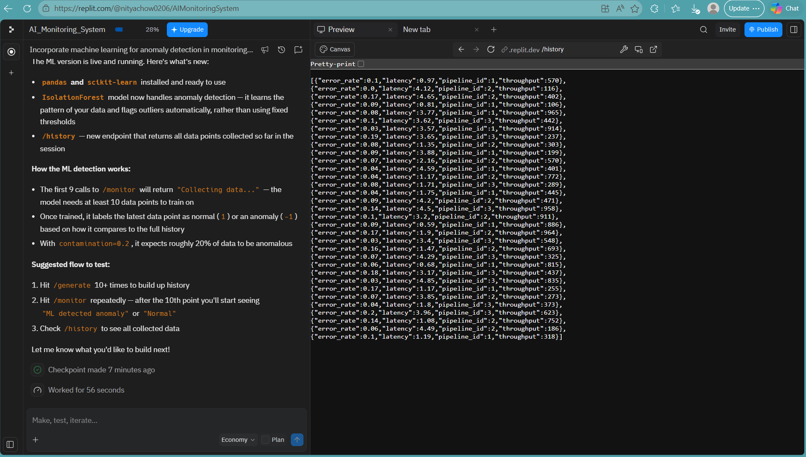
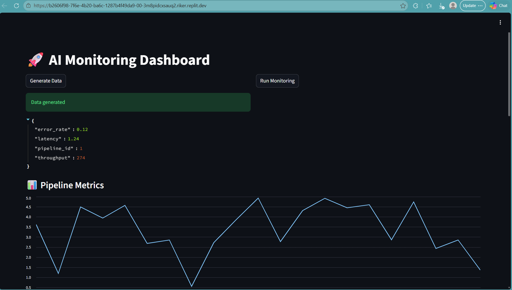
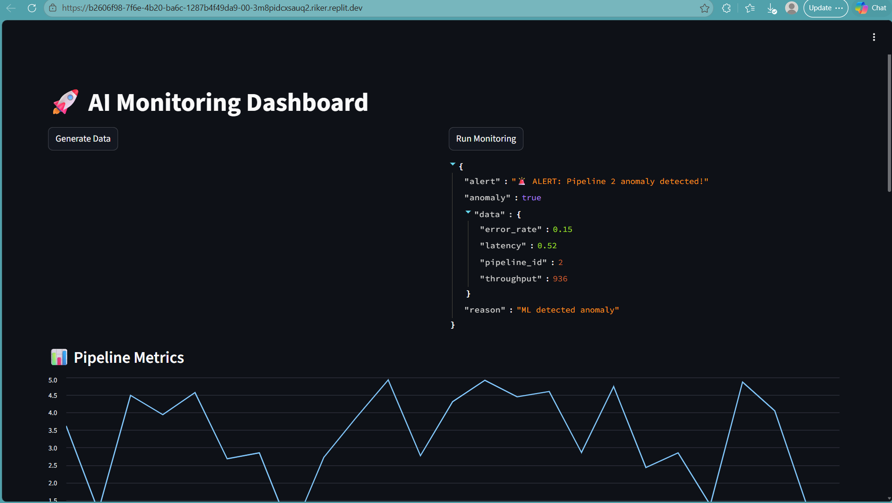
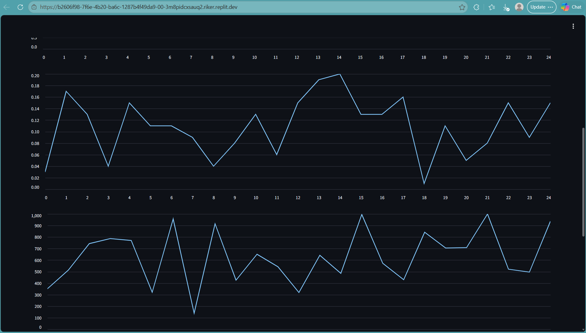
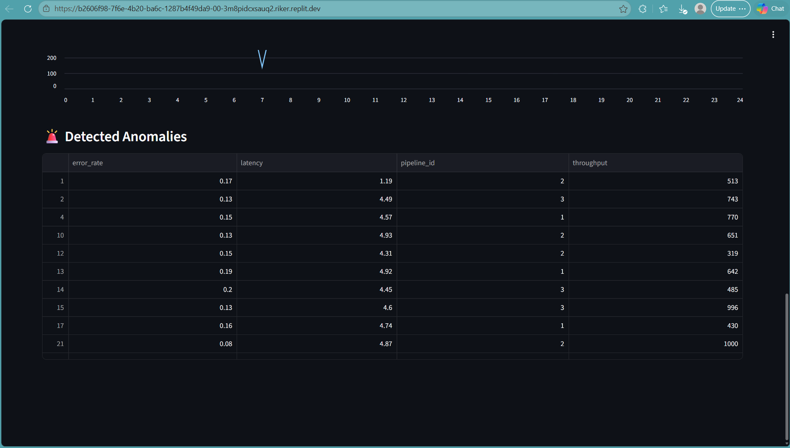

# 🚀 AI-Powered Data Pipeline Monitoring & Alerting System\

## 🚀 Live Demo
👉 https://b2606f98-7f6e-4b20-ba6c-1287b4f49da9-00-3m8pidcxsauq2.riker.replit.dev/

---

## 📌 Overview
This project simulates a real-time data pipeline monitoring system with AI-based anomaly detection and alerting.

It mimics how modern data platforms monitor ETL pipelines and detect failures automatically.

---

## 🧠 Features
- Real-time data simulation
- Streaming pipeline using queue
- AI anomaly detection (Isolation Forest)
- REST API backend (Flask)
- Interactive dashboard (Streamlit)
- Visual graphs for pipeline metrics
- Alert system for anomalies

---

## 🏗️ Architecture
Data Generator → Streaming Queue → Flask API → ML Model → Alerts → Dashboard

---

## ⚙️ Tech Stack
- Python
- Flask (Backend API)
- Streamlit (Dashboard UI)
- Scikit-learn (ML Model)
- Pandas (Data Processing)

---

## 📸 Screenshots

###📊 Dashboard Preview

---

## 🚀 How to Run
1. Clone the repository

git clone https://github.com/nityachow0206/Cloud-Based-AI-Data-Monitoring-Alerting-System.git
cd ai-monitoring-system

2. Install dependencies

pip install -r requirements.txt

3. Run backend server

python backend/main.py

4. Run dashboard

streamlit run dashboard/dashboard.py

